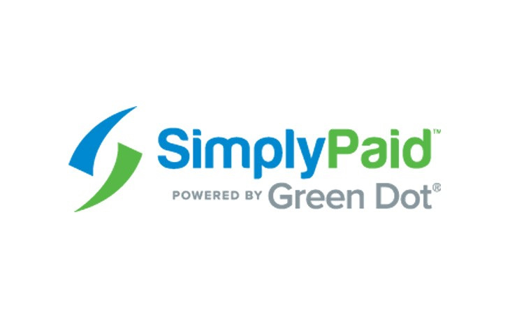

# CASE STUDY ANALYSIS

---

```
SimplyPaid is powered by Green Dot Corporation
```
---
## Overview and Origin
* Green Dot Corporation’s headquarters are located in Pasadena, California.  Geen Dot Corporation is the parent organization of SimplyPaid. 
* This company was originally formed in 1999 by Steve Streit to create prepaid debit cards for teenagers to shop online.  Green Dot also delivers technology driven payments platform solutions for Apple Pay Cash, Uber, and Intuit.   Overtime, Green Dot has been successful in the arena of mergers and acquisition of companies within the mobile, financial, tax industries such as Loopt, AccountNow, AchieveCard, UniRush Financial Services, and Santa Barbara Tax Products Group.  
* In the year 2010, Green Dot became a publicly traded venture with a market capitalization of $2 billion debuted as the world’s largest prepaid debit card company.
---
## Business Activities
* Green Dot provides technology delivered financial solutions to its clients.  Amongst its famous products and services are prepaid debit cards and cash reload solutions.  Additionally, Green Dot offers banking services catered by mobile technology.  
* The intended customers of this company are both consumers and businesses.  The market size of these consumers and producers are in the millions.  Green Dot offers value, quality, competitive, convenient, proprietary technology laced features of banking products for consumers and businesses at feasible costs.  
* The focus of this case study analysis is SimplyPaid’s proprietary technology, wholly owned by Green Dot Corporation.  SimplyPaid provides a financial network employed by technology to dispense money utilizing instant digital and traditional payout techniques. The following table describes their payout delivery options, payout management, disbursement platforms:

### Existing Account

- Instant payout to any bank account	

- Standard or same day ACH to any bank account

- Instant payout to existing reloadable debit card

- Instant payout to PayPal account

- Instant payout to Apple Pay Cash account

### New Account Setup

- New bank account with debit card

- New reloadable prepaid debit card

- New payroll card

### Additional Payout Options

- Cash pickup at a local Walmart

- Paper check delivery

### Payout Management

- Admin portal with full tracking and reporting

- Payment tracking, confirmation, and notifications

- API integration for maximum flexibility.

- Hosted integration for a quick launch with minimal effort.

- Integrated controls for risk management, fraud prevention, AML and BSA compliance.

- FDIC insured funding account provided by Green Dot Bank.

---
## Landscape

* This company is involved in Payment disbursements is the domain
* Over the past 5-10 years, a cloud based platform has been a major trend in this financial industry domain.  This innovative field has an extensive network delivering powerful management tools, risk controls, and robust money processing systems dispensing billions in payout solutions.
* Other major companies in the payment processing domain include:

Circle

Remitly

Stripe

Braintree

Aeropay

DailyPay

Bolt

PayPal

Ripple

Affirm

---

## Results

* SimplyPaid has streamlined payouts for the nation’s leading companies with billions of dollars being moved virtually at successful rates.
* Core metrics that companies in this domain use to measure success include demand, standardized uniform platform, financial strength as a liquidity provider, and flexible versatility.  
* Based on these metrics, SimplyPaid provides digitized payments which are faster and cheaper to cater to demands.
SimplyPaid offers convenient instant access or same day money disbursement solutions in standardized uniform platform.
Green Dot Corporation gives SimplyPaid the financial power to move liquidity.
SimplyPaid is flexible in administrating funding with no minimum or maximum quotas.  

* SimplyPaid ranks at #5 when compared to the leading competitors in the payment processing domain. 

Green Dot Corporation  
SimplyPaid
$1.7 billion 

(Rank #5)

Square	$5.5 billion

 (Rank #2)

Stripe	$9.2 billion

(Rank #1)

PayPal 	$2.8 billion

(Rank #3)

Adyen	$2 billion

(Rank #4)

Transferwise	$1.5 billion

(Rank #6)

Klarna	$1.2 billion

(Rank #7)

Boku	$1.2 billion

(Rank #7)

Apple Pay	$500 million

(Rank #8)

M-PESA	$400 million

(Rank #9)

Paytm	$400 million

(Rank #9)

---
## Recommendations
* If I were to advise this company on what products or services they offer, I would recommend and suggest an investment portal in their platform.  In which their clients can deposit money in an automated trading investment account which generates profits.  
* Offering investment and automated trading solutions for capital would benefit this company in increasing its market share and valuation as a result of satisfied customers.  
* This investment and robotic trading will utilize cloud computing. 
* Cloud computing will be appropriate for the investment solutions because they offer unique virtualization which is faster.  

---

## References

https://www.simplypaid.com/fintech-company

http://ir.greendot.com/investor-overview?c=235286&p=irol-irhome

https://www.greendot.com/about-us

https://www.simplypaid.com/payment-platform

https://builtin.com/fintech/fintech-payments-companies-examples

https://www.simplypaid.com/why-choose-simplypaid 

https://techbullion.com/top-10-fintech-payment-companies-worth/
# 1-Intro-to-Finance
